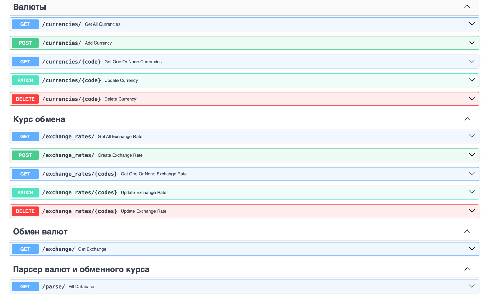

# REST API для управления обменными курсами валют

В данном проекте реализован `REST API` на `FastAPI` для управления обменным курсом валют.

Стэк: `Python`, `FastAPI`, `SQLAlchemy`, `Pydantic`, `PostgreSQL`, `Alembic`, `BeautifulSoup`



## Функционал

### `/currencies`

API для создания валют в базе данных валют. Реализован CRUD для создания валют в базе данных `currancies`.

Пример выполнения GET запроса `/currencies`:

```json
[
  {
    "id": 32,
    "code": "HKD",
    "name": "Hong Kong dollar"
  },
  {
    "id": 33,
    "code": "IDR",
    "name": "Indonesian rupiah"
  }
]
```

### `/exchange_rates`

API для создания обменного курса мужд двумя валютами. Реализован CRUD для создания обменного курса между валютами в базе
данных `exchange_rates`.

Пример выполнения GET запроса `/exchange_rates`:

```json
[
  {
    "id": 11,
    "base_currency": {
      "id": 16,
      "code": "BGN",
      "name": "Bulgarian lev"
    },
    "target_currency": {
      "id": 11,
      "code": "EUR",
      "name": "Euro"
    },
    "rate": 1.9558
  }
]
```

### `/exchange`

API для расчета обменного курса между валютами A и B.

- Если в базе данных `exchange_rates` есть пара валют A и B, то просто возвращается результат из базы данных.
- Если пары валют A и B нет, но есть B и A, то рассчитывается обменный курс на основе пары B и A.
- Если ни A и B, ни B и A нет, то проверяется если ли обменный курс в базе данных между EUR и A и между EUR и B.

Пример выполнения GET запроса `/exchange`:

```json
{
  "base_currency": {
    "id": 41,
    "code": "SGD",
    "name": "Singapore dollar"
  },
  "target_currency": {
    "id": 43,
    "code": "ZAR",
    "name": "South African rand"
  },
  "rate": 0.07201245814530854,
  "amount": 1,
  "converted_amount": 0.07201245814530854
}
```

`/parse`

API для заполнения баз данных `currencies` и `exchange_rates`. Валюты и обменные курсы парсятся через `BeautifulSoup` с
сайта https://www.iban.com/exchange-rates

## Установка и запуск

### Установка через виртуальное окружение

1. Клонируйте репозиторий:
   ```bash
   git clone https://github.com/kudrmax/exchange-rate-synchronizer/
   cd exchange-rate-synchronizer
   ```

2. Создайте и активируйте виртуальное окружение:
   ```bash
   python -m venv venv
   source venv/bin/activate  # для Windows: venv\Scripts\activate
   ```

3. Установите зависимости:
   ```bash
   pip install -r requirements.txt
   ```

5. Запустите приложение:
   ```bash
    python app/main.py  # python3 для UNIX-систем
   ```

6. Откройте браузер и перейдите по адресу [http://0.0.0.0:8000](http://0.0.0.0:8000).

### Установка через Poetry

1. Клонируйте репозиторий:
   ```bash
   git clone https://github.com/kudrmax/exchange-rate-synchronizer/
   cd exchange-rate-synchronizer
   ```

2. Установите Poetry, если он не установлен

3. Создайте виртуальное окружение и установите зависимости:
   ```bash
   poetry install
   ```

4. Активируйте виртуальное окружение:

   ```bash
   poetry shell
   ```

6. Запустите приложение:
   ```bash
   python app/main.py  # python3 для UNIX-систем
   ```

7. Откройте браузер и перейдите по адресу [http://0.0.0.0:8000](http://0.0.0.0:8000).

### Автор

- **Макс Кудряшов**: студент 3 курса «Прикладной математики» НИУ ВШЭ.
- Другие проекты: [GitHub](https://github.com/kudrmax/)
- Связаться: [Telegram](https://t.me/kudrmax)
